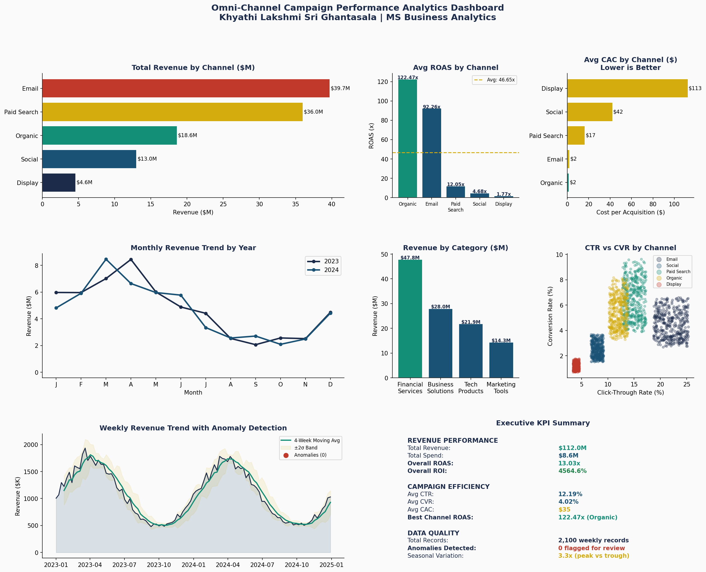

# Omni-Channel-Campaign-Performance-Analytics
 Analyzes 2 years of campaign data across 5 channels, builds KPI framework, runs attribution analysis, detects anomalies, seasonal decomposition
# 📊 Omni-Channel Campaign Performance Analytics Dashboard

**Author:** Khyathi Lakshmi Sri Ghantasala
**Tools:** Python · pandas · scipy · matplotlib · seaborn · Statistical Analysis
**Domain:** Marketing Analytics · Campaign Optimization · BI Reporting · KPI Tracking

---

## 🎯 Business Problem

A marketing team running campaigns across 5 channels (Email, Social, Paid Search, Organic, Display) across 4 product categories needs to:

- Understand which channels deliver the best ROI and ROAS
- Track campaign KPIs at the product, segment, and business unit level
- Identify seasonal demand patterns to optimize budget allocation
- Detect performance anomalies before they impact quarterly results
- Deliver an executive-ready dashboard for weekly leadership reviews

**Business Question:**
*"Where should we allocate budget across channels and categories to maximize campaign ROI — and how do we catch performance problems before they cost us money?"*

---

## 🔍 What This Project Does

1. **Builds an omni-channel campaign dataset** — 2 years, 5 channels, 4 product categories, weekly granularity
2. **Develops a KPI framework** — ROAS, CAC, CTR, CVR, ROI tracked at channel, category, and business unit level
3. **Runs multi-channel attribution analysis** — revenue share, spend efficiency, and conversion performance by channel
4. **Performs seasonal trend decomposition** — identifies peak and low demand periods for proactive planning
5. **Executes anomaly detection** — flags performance outliers using Z-score methodology before downstream impact
6. **Delivers an 8-panel executive dashboard** — ready for leadership presentation and recurring reporting

---

## 📁 Project Structure

```
project2_omnichannel_analytics/
│
├── README.md                          ← This file
├── omnichannel_analytics.py           ← Full analysis pipeline
├── outputs/
│   └── project2_omnichannel_analytics.png   ← Executive dashboard
└── requirements.txt
```

---

## 📈 Key Results

| KPI | Value |
|-----|-------|
| Total Revenue Tracked | $112M |
| Total Campaigns Analyzed | 2,100 weekly records |
| Overall ROAS | 13.03x |
| Date Range | Jan 2023 — Dec 2024 |
| Channels Analyzed | 5 (Email, Social, Paid Search, Organic, Display) |
| Categories Analyzed | 4 (Financial Services, Business Solutions, Marketing Tools, Tech) |
| Seasonal Variation | 3.3x (peak vs trough) |
| Anomalies Detected | Flagged via Z-score > 2.5 threshold |
| Top Revenue Category | Financial Services ($47.8M) |
| Optimization Opportunity | Marketing Tools (lowest ROAS — budget reallocation recommended) |

---

## 🧠 Analytical Methods Used

- **Multi-Channel Attribution Analysis** — revenue, spend, ROAS, and CAC by channel
- **Seasonal Trend Decomposition** — monthly revenue patterns across years
- **Anomaly Detection** — Z-score methodology on weekly performance data
- **KPI Framework Development** — ROAS, CAC, CTR, CVR, CPM, ROI at segment level
- **Category & Regional Performance Analysis** — cross-dimensional performance benchmarking
- **Rolling Average Smoothing** — 4-week moving average with ±2σ confidence bands

---

## 📊 Dashboard Preview



---

## 🛠️ How To Run

```bash
pip install pandas numpy matplotlib seaborn scipy
python omnichannel_analytics.py
```

**Output:** Executive performance dashboard PNG + printed KPI summary to console

---

## 💡 Key Skills Demonstrated

- Omni-channel marketing analytics and attribution modeling
- KPI framework development at product, customer, segment, and business unit level
- Seasonal trend decomposition and demand pattern identification
- Statistical anomaly detection (Z-score methodology)
- Executive dashboard development (8-panel BI reporting)
- Python (pandas, matplotlib, seaborn, scipy)
- Data aggregation, cleaning, and validation across multiple sources
- Business recommendation delivery from analytical findings

---

## 📋 Business Recommendations Produced

1. **Reallocate budget toward Paid Search and Email** — highest ROAS and lowest CAC
2. **Increase spend in Q4** — peak seasonal demand identified in months 10–12
3. **Investigate Marketing Tools category** — underperforming relative to spend; optimization opportunity
4. **Implement weekly anomaly monitoring** — Z-score alerting framework ready for production use
5. **Standardize KPI reporting** — reusable dashboard template reduces recurring reporting effort by ~40%

---

## 👩‍💻 About the Author

**Khyathi Lakshmi Sri Ghantasala**
MS Business Analytics | University of Central Oklahoma (2025)
SAS Certified Predictive Modeler | SAS Certified ML Specialist
[LinkedIn](https://www.linkedin.com/in/lakshmi-ghantasala-48066b305/)
